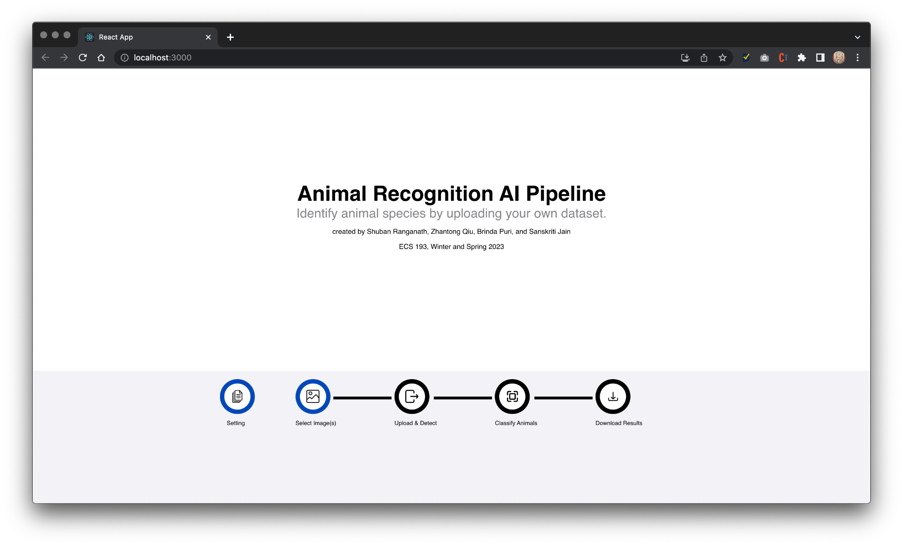

# AI-based-animal-recognition
AI-based animal recognition using trail camera images

## Description
Camera traps provide data on species location, population sizes and how species are interacting. They also help us to understand how humans and livestock interact with each other and other forms of wildlife. The data collected can give insights about risks and dangers to specific species and are also used to study and warn the world about the effects of climate change. SD card used on these camera's can range anywhere between 32GB to 128GB. This is about 2,000 to 8,000 jpeg images! Researchers then have to sort through and manually label this data. The aim of this project was to reduce the burden faced by  wildlife rearchers as they go through multiple camera trap images to study various different animals. 

To address this issue we designed an AI pipline to run a set of these images and sort them using Yolo v8, ResNet and ViT models. Additionally, we also created a frontend so that users without much knowleage of ML models can still use the software to their advantage. The web app launched allows users in input images into the pipline. The images first go through the Yolo v8 model which is used for object detection. This seprates the images into two categories -  animal and no animal. Then the set of images with animals detected would pass through the pipline into the next model. Here the user gets to choose between two classification models - ResNet and ViT. After the selection the model runs and classifies the image based on the animal type.

Implementing this project led to several learnings which include but not limited to different types of ML models, data analysis techniques, frontend - backend interations, dependencies, unit testing, filesystem orgranization and so much more.

## Table of Contents

If your README is long, add a table of contents to make it easy for users to find what they need.

- [Installation](#installation)
- [Usage](#usage)
- [Credits](#credits)
- [License](#license)

## Installation

Download the project from this github site. Open terminal go to DeployAnmialDetection folder. You can do this by typing the following

```console
cd Downloads/AI-based-animal-recognition-main/flask-webapp/DeployAnmialDetection
```

Then type the command below. This runs a script that will install all the dependencies required for this project

```console
./runscript.sh
```
Your browser should open a window at `localhost:3000` that looks like this




## Usage

Provide instructions and examples for use. Include screenshots as needed.

## Credits
> Zhantong Qiu (https://github.com/studyztp)

> Shuban Ranganath (https://github.com/DrinkableBook)

> Sanskriti Jain (https://github.com/sanjain13)

> Brinda Puri (https://github.com/BrindaPuri)


## License

The last section of a high-quality README file is the license. This lets other developers know what they can and cannot do with your project. If you need help choosing a license, refer to [https://choosealicense.com/](https://choosealicense.com/).

## Badges


Badges aren't necessary, per se, but they demonstrate street cred. Badges let other developers know that you know what you're doing. Check out the badges hosted by [shields.io](https://shields.io/). You may not understand what they all represent now, but you will in time.

## Features

If your project has a lot of features, list them here.

## Tests

Type this in your terminal to start the sample test cases. The test cases can be found in App.test.js whose file path is AI-based-animal-recognition-main/flask-webapp/DeployAnmialDetection/animalDetection/frontend/src

```console
npm test
```
